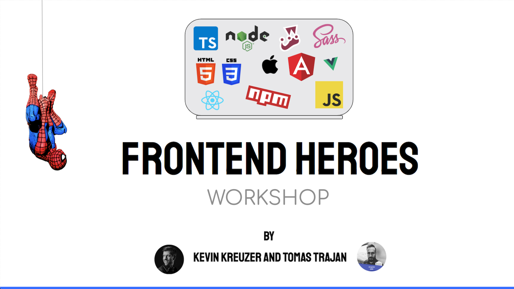

**Nice to see you here. You being here, means you are ready to become a frontend hero 
in an enterprise project. This workshop will help you kick start your career as a frontend developer 
and teach you the most important technologies of a modern frontend web development stack.**

This is the repository with a collection of useful exercises 
that give you hands on experience on a simplified version of a modern frontend web development stack. 
This repository contains the following exercises:

### Web development basics

In this exercise we are going to create a hero website. 
We are going to learn how to structure our HTML page, 
use CSS to style it and use some JavaScript to add logic to our page.

### Developer tools

In this exercise we will encounter a finished version of the first exercise. 
As it turns out, we included some bugs. It's your job to use the dev tools 
to track down and fix these bugs.

### Sass and TypeScript

In this exercise we will enrich our application with Saas and TypeScript.
We will learn what does it take to convert CSS to Sass and JavaScript to TypeScript. 
Furthermore, we are going to learn how to compile Sass to CSS and TypeScript to JavaScript.

### Npm scripts - watch

In this exercise we will use npm (node package manager) in our project.
We learn how to create a new `package.json`, how to install dev dependencies 
and how to add useful new scripts that will automatically compile Sass and TypeScript
while we are developing our application.

### Npm scripts - build

In this exercise we will learn how to correctly install dependencies 
in an existing repository with a `package.json` file. We will also add some more development 
scripts, for example a new `build` script. This script will build our application
and generate an artifact which we can then deploy to a webserver and deliver into production.

